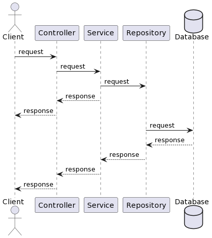
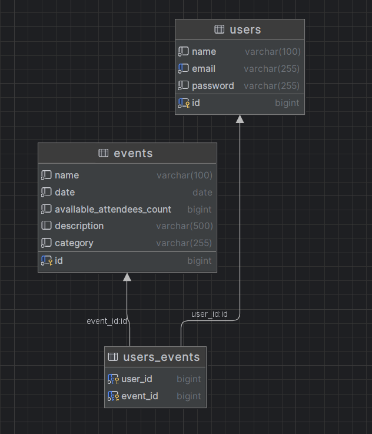
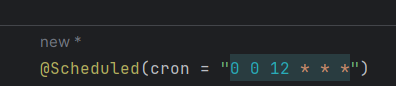
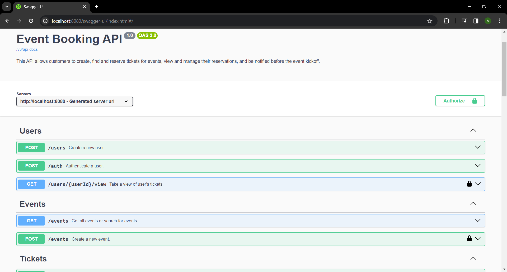

# Booking to Event
This API allows customers to create, find and reserve tickets for events, view and manage their reservations, and be notified before the event kickoff.
This application will help to create this microservice on java.

___
# Sequence diagram
This how would work application:

1. The client sends request to the Controller, which resend request to a service.
2. Service get request and resend to the Repository.
3. Repository sends request to the Database
4. The database processed the request and sent back.
___

# Table diagrams
Simple action to edit the note:

We have two main classes - User and Event.

The user table representation of user in this application. User can auth, create events and get all event.

The event table represents event in this application. An event can be created by the user.

Also, on Event you can reserve the ticket for the event or cancel your reserving.

___

# Environments

To run this application you need to create `.env` file in root directory with next environments:
* `POSTGRES_HOST` - host of Postgresql database
* `POSTGRES_PORT` - port of Postgresql database
* `POSTGRES_USERNAME` - username for Postgresql database
* `POSTGRES_PASSWORD` - password for Postgresql database
* `POSTGRES_DATABASE` - name of Postgresql database
* `POSTGRES_SCHEMA` - name of Postgresql schema
* `JWT_SECRET` - secret string for JWT tokens
* `JWT_DURATION` - duration time to expire the token(in hour)
* `SPRING_MAIL_HOST` - host of mail 
* `SPRING_MAIL_PORT` - port of mail
* `SPRING_MAIL_USERNAME` - username for email, which would send notification
* `SPRING_MAIL_PASSWORD` - password fo email

___

# How to work for this application
1. You need to have Docker Engine and Docker Compose on your machine (or Docker Desktop).
2. Add `.env` file in application directory and wrote all above environments with variable.
3. After you finish the 1st and 2nd points you can download this application and do "docker compose up" in the application directory.
4. Then you can check all application endpoints on swagger(http://localhost:8080/swagger-ui/index.html).
5. The post method "/users" endpoint create a user for application with the next parameters: name, email and password. 
6. The post method "/auth" endpoint allows us to get token for passing authentication process. The request need email and password.
7. The post method "/events" endpoint creates an event for application with a parameter: id, name, date, available count, description and category.
8. The get method "events" endpoint allows us get into all event from the table. At this point we use three variables: name, event, started dating, ended date and category.
9. The post method "events/{eventId}/tickets" let us reserve the place in the event.
10. The post method "events/{eventId}/cancel" allows us cancel a user's reservation.
11. The get method "/users/{userId}/view" gets all event of reserving by the user.
12. After you finish the job, press "CTRL+C" for stopping docker container.

Also, I add a json file to Postman app([PostmanCollectionEndPoints.json](PostmanCollectionEndPoints.json)). If you don't like the swagger you can use Postman for this target.

P.S. Reminder Service is notification user about event at 12:00, but you can change it in ReminderImpl.class on here 

Use Cron pattern:https://crontab.guru/

Also add swagger page:

Also application have Logger support, which create 3 different file: app.log, bookingevent.log and audit.log:

1. app.log - save log info about working API.
2. audit.log - save info about notification user with using mail.
3. bookingevent.log - save info about working application.

