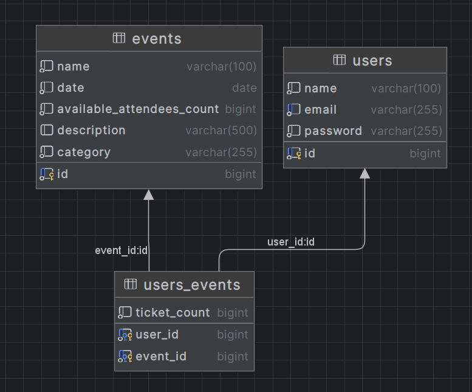

# Booking to Event
This API allows customers to create, find and reserve tickets for events, view and manage their reservations, and be notified before the event kickoff.
This application will help to create this microservice on java.

___
# Sequence diagram
This how would work application:

1. Client send request to Controller, which resend request to service
2. Service get request and resend to Repository
3. Repository send request to Database
4. The database processed the request and sent back
___

# Table diagrams
Simple action to edit note:

We have two main classes - User and Task.

User table represents user in this application. User can auth, create event and get all event.

Event table represents event in this application. Event can be created by user.

Also on Event you can reserve the ticket for event or cancel your reserving.  

___

# Environments

To run this application you need to create `.env` file in root directory with next environments:
* `POSTGRES_HOST` - host of Postgresql database
* `POSTGRES_PORT` - port of Postgresql database
* `POSTGRES_USERNAME` - username for Postgresql database
* `POSTGRES_PASSWORD` - password for Postgresql database
* `POSTGRES_DATABASE` - name of Postgresql database
* `POSTGRES_SCHEMA` - name of Postgresql schema
* `JWT_SECRET` - secret string for JWT tokens

___

# What I'm planning to add in future update
* Add more Unit test to project
* Created email notifications
* More specific instruction to endpoint
* Add log for audit notification
* Add "README.md" more instruction to work with app  